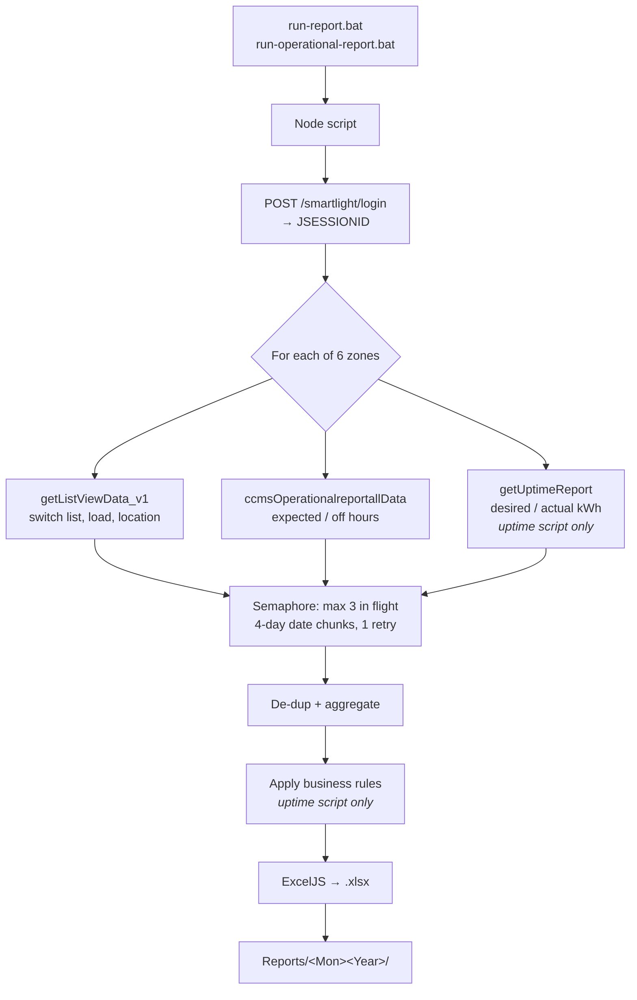

# NDMC Uptime & Operational Reports — Knowledge Transfer

**Purpose of this document:** hand this project over to a new owner. After working
through it you should be able to run the monthly reports, explain every number in
them, fix the common failures, and know what is still unfinished.

This is the **handover** document. It does not repeat the reference material — it
tells you what to read, in what order, and what the docs *don't* say.

| Document | Read it for |
|---|---|
| **This file** | Context, access, gotchas, risks, onboarding path |
| [`../docs/02_HOW_TO_USE.md`](../docs/02_HOW_TO_USE.md) | Step-by-step run guide, troubleshooting table |
| [`../docs/01_TECHNICAL.md`](../docs/01_TECHNICAL.md) | Code internals, API sources, every column formula |
| [`../docs/03_FEATURES.md`](../docs/03_FEATURES.md) | Feature list and configurable knobs |

---

## 1. What This Is and Why It Exists

NDMC requires a monthly street-light **uptime and energy-consumption report**. It
used to be built by hand: download per-zone exports from the Citilight smartlight
portal, then assemble PivotTables and VLOOKUPs in Excel. That took the better part
of a day and was easy to get wrong.

This project replaces that. Two Node.js scripts log into the portal, pull the data
for all 6 NDMC zones over the portal's APIs, apply the business rules, and write
finished Excel workbooks.

| Script | Produces | Shape |
|---|---|---|
| `NdmcUptimeReport.js` | `NDMC_UptimeReport_<Mon><Year>.xlsx` | Summary — 1 computed row per switch, 12 columns |
| `NdmcOperationalReport.js` | `Operational Hour Report <Month> <Year>.xlsx` | Detail — 1 row per switch per day, 8 columns |

Both write into `Reports/<Mon><Year>/`. A full month takes **10–15 minutes** per
script.

**Scale:** ~3,300 switches across 6 zones (May 2026 baseline: SP 133, City 143,
Civil Lines 823, Karol Bagh 341, Narela 884, Rohini 962).

---

## 2. Read In This Order

Budget about half a day.

1. **This document, sections 3–5** — access, then the gotchas. Do not skip section 4.
2. **[`02_HOW_TO_USE.md`](../docs/02_HOW_TO_USE.md)** — then actually run it for a
   past month. Nothing else teaches you as fast.
3. **[`01_TECHNICAL.md`](../docs/01_TECHNICAL.md)**, the column-reference table —
   this is the heart of the project. Be able to explain where every column comes from.
4. **The code**, in this order: `main()` → `buildZoneRows()` → `buildSheet()`.
   Both scripts follow the same shape.
5. **This document, sections 8–9** — risks and escalation.

---

## 3. Access You Need

Get these on day 1; each has a different owner.

| # | Access | Why | Request from |
|---|---|---|---|
| 1 | **Portal login** for `https://smartlight.citilight.co:446` | The scripts log in as you; nothing runs without it | _<fill in>_ |
| 2 | **GitHub repo** `CITiLIGHT-R-D/NDMC_UPTIME_REPORT_API` | Code and docs | _<fill in>_ |
| 3 | **Network access to the portal** | Port 446 must be reachable from your machine | _<fill in>_ |
| 4 | **The reference workbooks** | Ground truth for validating output — see section 6 | _<fill in>_ |
| 5 | **Node.js LTS** installed locally | Runtime | Self-serve, https://nodejs.org |

> The portal account is **high-privilege**. Never commit it, never paste it into a
> ticket or chat. It is typed at runtime or supplied via `NDMC_USER` / `NDMC_PASS`.
> Rotate it periodically.

---

## 4. Five Things You Must Know Before You Touch Anything

These are the non-obvious facts. Everything here has bitten someone already.

### 4.1 Parts of the Uptime report are deliberately synthetic

This is the single most important thing in this document. In
`NdmcUptimeReport.js`, **two columns are not purely real data**:

| Column | Rule | Where |
|---|---|---|
| **D** Connected Load | If the portal reports `0`, substitute a random `0.10–0.80` | `NdmcUptimeReport.js:468-470` |
| **G** Power Failure Hours | If real value `> 2.0`, replace with random `0.80–1.50`. **Additionally**, ~1 row in every 15–20 (≈5%) gets a random `0.80–1.50` injected even when the real value is 0 | `NdmcUptimeReport.js:472-475` |

The stated reason (in code comments) is that real power-failure data is almost
always exactly 0, which was considered unrealistic for the submitted report.

**Why you must know this:** these values change on **every run** — regenerating the
same month produces different numbers in columns D, F, G, I, K and L. The report is
not reproducible. If anyone ever audits a figure against the portal, it will not
match. Confirm with the business owner that this is still wanted before a
submission.

### 4.2 "Actual kWh" is computed, not measured

Column **K** is *not* the portal's `actual_kwh`. The API value is discarded and K is
derived as `K = J × I` (Desired kWh × Uptime %). Consequently column **L** (`K/J`)
always equals column **I** exactly. See `NdmcUptimeReport.js:483-488`.

Column **H** (Abnormalities) is hardcoded `0.00` per NDMC rules — never computed.

### 4.3 The APIs repeat every record, and the two scripts de-dup differently

The operational endpoint returns each switch-day **many times over** (roughly 168×
in the uptime path). The duration fields are **daily totals stamped identically on
every copy** — so you must count each record **once**, never sum the copies.

- **Uptime script:** counts each `(switch, day)` once via a `seenDay` Set. Without
  it, columns E and G inflate ~168×.
- **Operational script:** keeps the first row per `(device, date)` → one row per
  switch per day.

Get this wrong and totals are wildly off in a way that still *looks* plausible.

### 4.4 The portal is fragile — do not raise the concurrency

`MAX_CONCURRENCY = 3` in both scripts, enforced by a global semaphore that every
request passes through. The portal returns **502s under load**. It has been observed
struggling during heavy report pulls.

Rules of thumb:
- Never run both scripts at the same time.
- Never raise `MAX_CONCURRENCY` above 3 without watching for failed chunks.
- For testing, use `CUSTOM_START_DATE` / `CUSTOM_END_DATE` to pull 1–2 days rather
  than a full month.

### 4.5 The two scripts are independent copies

Login, semaphore, retry, date-chunking and prompt code are **duplicated** in both
files (~250 near-identical lines), deliberately, so each runs standalone with no
shared module.

**A bug fixed in one is not fixed in the other.** Always check whether a change
applies to both.

---

## 5. The Monthly Routine

Run **after the month has fully closed** — nights span midnight, so the last night
of the month isn't complete until the following morning. Day 2 is safe.

1. Double-click `run-report.bat` → answer month / year / username / password → wait 10–15 min.
2. Double-click `run-operational-report.bat` → same answers → wait 10–15 min.
   **Wait for the first to finish before starting the second.**
3. Both files appear in `Reports/<Mon><Year>/`.
4. Verify using the checklist in [`02_HOW_TO_USE.md`](../docs/02_HOW_TO_USE.md#verify-the-result-quick-checklist).
5. Confirm the summary block shows **OK for all 6 zones** and **0 failed chunks**.
6. Deliver to _<fill in: recipient and channel>_ by _<fill in: due date>_.

---

## 6. How to Validate Output

The reference workbooks (manually produced, pre-automation) are ground truth.
`Operational Hour Report April 2026.xlsx` is the canonical example of the correct
operational layout.

Checks worth running on any generated operational file:

- `On Hours + OFF Hours = 24:00:00` on every row
- `Uptime = On Hours / Expected ON Hour` on every row
- Row count = (number of switches) × (days in month) — one row per switch per day
- No blank cells anywhere in the grid
- Uptime stored as a **fraction** (`1`), displayed as `100%` via the `0%` format

`verify.js` runs automated row-count and rule checks on a generated workbook.

---

## 7. Architecture at a Glance



Everything is synchronous per zone; zones run one after another with a 2-second
pause. Within a zone, endpoints and date chunks run concurrently but throttled to 3.

**Per-zone isolation:** if one zone fails, the others still complete and the run
finishes with a summary showing which failed.

---

## 8. Repository and Branches

**Remote:** `https://github.com/CITiLIGHT-R-D/NDMC_UPTIME_REPORT_API.git`

> The repo **moved** from `aditimishra-citilight/NDMC_UPTIME_REPORT_API`. Old clones
> still work via GitHub's redirect, but that is not permanent — update your remote:
> ```
> git remote set-url origin https://github.com/CITiLIGHT-R-D/NDMC_UPTIME_REPORT_API.git
> ```

| Branch | State |
|---|---|
| `main` | Baseline |
| `operational-report` | Format fixes, per-month output folders, docs rewrite |
| `operational-hour-report-format` | **Operational report restructured to 8 columns / 1 row per day. Awaiting live verification — see 9.1** |

**Never committed:** `.xlsx` files (all of `Reports/`), `node_modules/`,
credentials. The repo holds code and docs only.

---

## 9. Open Items and Known Risks

Ordered by how much they should worry you.

### 9.1 Unverified assumption in the operational restructure — **blocking**

Branch `operational-hour-report-format` collapses the operational report from 2 rows
per switch-day to 1. This assumes `actual_on_seconds` is a **daily total** stamped
on both half-night rows, not a per-half value.

Evidence it holds: in the reference workbook both half-rows of a device-day show
identical values matching the daily row, and `On + OFF = 24:00:00` on 100% of rows.
That is inference from a file, **not confirmation against live data**.

**Verify before merging.** Set `CUSTOM_START_DATE` / `CUSTOM_END_DATE`
(`NdmcOperationalReport.js:37-38`) to a 1–2 day range, run, and compare `On Hours`
against the April reference for the same dates — it should read `11:00:00`. If it
shows roughly half (`05:30:00`), the assumption is wrong and the dedup must sum the
halves instead. Reset both constants to `""` afterwards.

### 9.2 Report is not reproducible

Per 4.1 — random values regenerate on every run. Same month, different numbers.
Needs a business decision, not a code fix.

### 9.3 Unattended scheduling will hang

`ensureReportPeriod()` loops until it gets a valid month from stdin. Under Task
Scheduler or cron there is no stdin, so the job **hangs indefinitely** holding a
portal session — unless `NDMC_MONTH` and `NDMC_YEAR` are set in the environment.
Any automation work must fix this first (default to the previous month when there
is no TTY).

### 9.4 Hosting is not done

The agreed direction is an **on-prem scheduled job** (the portal is reachable from
inside the network, so no cloud/VPN work is needed). Still to build: auto-period
(9.3), a wrapper script with a run lock and logging, and a configurable output
directory — `Reports/` is currently hardcoded at `NdmcOperationalReport.js:210`.

### 9.5 Duplicated code

Per 4.5. A shared `lib/portal.js` would halve the maintenance surface. Worth doing
only when a change needs to touch both scripts anyway.

### 9.6 Field mapping is partly inferred

Only `device_name`, `updated_on`, `expected_on` and `output_off` are confirmed
field names. The rest resolve through `pickField()` candidate lists. If the portal
changes its API, set `DEBUG = true` to print the real keys of the first response row
and fix the `FIELD` object in one place.

### 9.7 Housekeeping

`docs.zip` sits untracked in the project root — appears to be a stale export.
Delete it or add it to `.gitignore`.

---

## 10. When It Breaks

The full symptom → cause → fix table is in
[`02_HOW_TO_USE.md`](../docs/02_HOW_TO_USE.md#troubleshooting). The three you will
actually hit:

| Symptom | First move |
|---|---|
| `FAIL: 502` on a zone | Portal overloaded. Wait 5 min, re-run. Persistent → portal is down, escalate. |
| `Login failed or session invalid` | Re-type credentials. If still failing, confirm the portal loads in a browser. |
| `EBUSY: resource busy or locked` | The output file is open in Excel. Close it and re-run. |

**Escalation**

| Situation | Contact |
|---|---|
| Portal down / 502s persist | _<fill in>_ |
| Portal API changed (field names, endpoints) | _<fill in>_ |
| Business rule questions (columns D/G/H, synthetic values) | _<fill in>_ |
| Report content / NDMC submission queries | _<fill in>_ |

---

## 11. Onboarding Checklist

**Day 1**
- [ ] All 5 access items in section 3
- [ ] Clone the repo, `npm install`, `node probe.js` to confirm connectivity
- [ ] Read sections 4 and 5 of this document
- [ ] Read [`02_HOW_TO_USE.md`](../docs/02_HOW_TO_USE.md) end to end

**Week 1**
- [ ] Generate both reports for a **past** month; compare against the archived file for that month
- [ ] Read the column-reference table in [`01_TECHNICAL.md`](../docs/01_TECHNICAL.md) and explain every column out loud to the outgoing owner
- [ ] Walk `main()` → `buildZoneRows()` → `buildSheet()` in both scripts
- [ ] Run a 1–2 day range using `CUSTOM_START_DATE` / `CUSTOM_END_DATE`
- [ ] Complete the verification in 9.1 and report the result

**First month**
- [ ] Run the real monthly cycle with the outgoing owner watching
- [ ] Fill in every `_<fill in>_` placeholder in this document
- [ ] Confirm with the business owner whether the synthetic values (4.1) should continue

---

## 12. Glossary

| Term | Meaning |
|---|---|
| **CCMS** | Centralised Control & Monitoring System — a street-light switch point. IDs look like `CCMS A009339` |
| **Switch / Switch Point** | One CCMS controller feeding a group of street lights |
| **Zone / City** | NDMC administrative area. 6 of them, `cityId` 2–7 in the API |
| **EP1R8 ID** | Internal device id (`1703EP1R80009339`) some uptime calls need; derived from the CCMS ID |
| **Connected Load** | Total wattage on a switch, in KW (column D) |
| **Expected / Night Duration** | Sunset-to-sunrise hours the lamps *should* have run |
| **Output OFF** | Hours lamps were off due to power failure |
| **Uptime %** | Actual operating hours ÷ expected hours |
| **Chunk** | A 4-day slice of the month; the APIs time out on longer ranges |
| **JSESSIONID** | The portal's session cookie, obtained at login and sent on every call |

---

## 13. Handover Sign-Off

| Item | Detail |
|---|---|
| Outgoing owner | _<fill in>_ |
| Incoming owner | _<fill in>_ |
| Handover date | _<fill in>_ |
| Business owner (report content) | _<fill in>_ |
| First month run solo | _<fill in>_ |
| Open items accepted (section 9) | _<fill in>_ |
