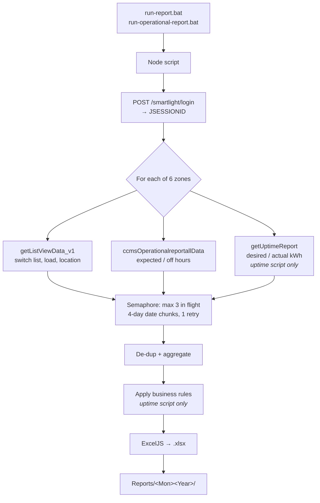

# NDMC Uptime & Operational Reports — Knowledge Transfer

**Purpose of this document:** hand this project over to a new owner. After working
through it you should be able to run the monthly reports, explain every number in
them, fix the common failures, and know what is still unfinished.

This is the **handover** document. It does not repeat the reference material — it
tells you what to read, in what order, and what the docs *don't* say.

| Document | Read it for |
|---|---|
| **This file** | Context, access, gotchas, risks, onboarding path |
| [`../docs/02_HOW_TO_USE.md`](../docs/02_HOW_TO_USE.md) | Step-by-step run guide, troubleshooting table |
| [`../docs/01_TECHNICAL.md`](../docs/01_TECHNICAL.md) | Code internals, API sources, every column formula |
| [`../docs/03_FEATURES.md`](../docs/03_FEATURES.md) | Feature list and configurable knobs |

---

## 1. What This Is and Why It Exists

NDMC requires a monthly street-light **uptime and energy-consumption report**. It
used to be built by hand: download per-zone exports from the Citilight smartlight
portal, then assemble PivotTables and VLOOKUPs in Excel. That took the better part
of a day and was easy to get wrong.

This project replaces that. Two Node.js scripts log into the portal, pull the data
for all 6 NDMC zones over the portal's APIs, apply the business rules, and write
finished Excel workbooks.

| Script | Produces | Shape |
|---|---|---|
| `NdmcUptimeReport.js` | `NDMC_UptimeReport_<Mon><Year>.xlsx` | Summary — 1 computed row per switch, 12 columns |
| `NdmcOperationalReport.js` | `Operational Hour Report <Month> <Year>.xlsx` | Detail — 1 row per switch per day, 8 columns |

Both write into `Reports/<Mon><Year>/`. **Since Aug 2026 this runs automatically on
the 2nd of each month and emails the results** — see section 6. A full month takes
roughly 2–4 hours (see 10.4 for why it is slow).

**Scale:** ~3,300 switches across 6 zones (May 2026 baseline: SP 133, City 143,
Civil Lines 823, Karol Bagh 341, Narela 884, Rohini 962).

---

## 2. Read In This Order

Budget about half a day.

1. **This document, sections 3–6** — access, the gotchas, and how the automation runs.
   Do not skip section 4.
2. **[`02_HOW_TO_USE.md`](../docs/02_HOW_TO_USE.md)** — then actually run it for a
   past month. Nothing else teaches you as fast.
3. **[`01_TECHNICAL.md`](../docs/01_TECHNICAL.md)**, the column-reference table —
   this is the heart of the project. Be able to explain where every column comes from.
4. **The code**, in this order: `main()` → `buildZoneRows()` → `buildSheet()`.
   Both scripts follow the same shape.
5. **This document, sections 10–11** — open risks and escalation.

---

## 3. Access You Need

Get these on day 1; each has a different owner.

| # | Access | Why | Request from |
|---|---|---|---|
| 1 | **Portal login** for `https://smartlight.citilight.co:446` | The scripts log in as you; nothing runs without it | _<fill in>_ |
| 2 | **GitHub repo** `CITiLIGHT-R-D/NDMC_UPTIME_REPORT_API` | Code and docs | _<fill in>_ |
| 3 | **Network access to the portal** | Port 446 must be reachable from your machine | _<fill in>_ |
| 4 | **The reference workbooks** | Ground truth for validating output — see section 7 | _<fill in>_ |
| 5 | **Node.js LTS** installed locally | Runtime | Self-serve, https://nodejs.org |
| 6 | **Gmail App Password** for `aditi.mishra@citilight.co` | Sends the monthly email. Same account and password the ConnectivityReport project already uses (`mail.env.bat` in that folder) | _<fill in>_ |

All of 1, 3 and 6 live in **`config.env`** (git-ignored). Copy `config.env.example`,
fill it in, then prove it works with `node check-config.js --live` — that performs a
real portal login and a real SMTP login without downloading data or sending mail.

> The portal account is **high-privilege**. Never commit it, never paste it into a
> ticket or chat. It is typed at runtime or supplied via `NDMC_USER` / `NDMC_PASS`.
> Rotate it periodically.

---

## 4. Six Things You Must Know Before You Touch Anything

These are the non-obvious facts. Everything here has bitten someone already.

### 4.1 Parts of the Uptime report are deliberately synthetic

This is the single most important thing in this document. In
`NdmcUptimeReport.js`, **two columns are not purely real data**:

| Column | Rule | Where |
|---|---|---|
| **D** Connected Load | If the portal reports `0`, substitute a random `0.10–0.80` | `NdmcUptimeReport.js:468-470` |
| **G** Power Failure Hours | If real value `> 2.0`, replace with random `0.80–1.50`. **Additionally**, ~1 row in every 15–20 (≈5%) gets a random `0.80–1.50` injected even when the real value is 0 | `NdmcUptimeReport.js:472-475` |

The stated reason (in code comments) is that real power-failure data is almost
always exactly 0, which was considered unrealistic for the submitted report.

**Why you must know this:** these values change on **every run** — regenerating the
same month produces different numbers in columns D, F, G, I, K and L. The report is
not reproducible. If anyone ever audits a figure against the portal, it will not
match. Confirm with the business owner that this is still wanted before a
submission.

### 4.2 "Actual kWh" is computed, not measured

Column **K** is *not* the portal's `actual_kwh`. The API value is discarded and K is
derived as `K = J × I` (Desired kWh × Uptime %). Consequently column **L** (`K/J`)
always equals column **I** exactly. See `NdmcUptimeReport.js:483-488`.

Column **H** (Abnormalities) is hardcoded `0.00` per NDMC rules — never computed.

### 4.3 The APIs repeat every record, and the two scripts de-dup differently

The operational endpoint returns each switch-day **many times over** (roughly 168×
in the uptime path). The duration fields are **daily totals stamped identically on
every copy** — so you must count each record **once**, never sum the copies.

- **Uptime script:** counts each `(switch, day)` once via a `seenDay` Set. Without
  it, columns E and G inflate ~168×.
- **Operational script:** keeps the first row per `(device, date)` → one row per
  switch per day.

Get this wrong and totals are wildly off in a way that still *looks* plausible.

### 4.4 The portal is fragile — do not raise the concurrency

`MAX_CONCURRENCY = 3` in both scripts, enforced by a global semaphore that every
request passes through. The portal returns **502s under load**. It has been observed
struggling during heavy report pulls.

Rules of thumb:
- Never run both scripts at the same time.
- Never raise `MAX_CONCURRENCY` above 3 without watching for failed chunks.
- For testing, use `CUSTOM_START_DATE` / `CUSTOM_END_DATE` to pull 1–2 days rather
  than a full month.

### 4.5 The two scripts are independent copies

Login, semaphore, retry, date-chunking and prompt code are **duplicated** in both
files (~250 near-identical lines), deliberately, so each runs standalone with no
shared module.

**A bug fixed in one is not fixed in the other.** Always check whether a change
applies to both.

### 4.6 A report can look finished while holding only part of the month

**This is the defect that nearly reached NDMC.** In the July 2026 report the Rohini
sheet held **4 days of data out of 31** — yet the run reported `OK` for every zone
and produced a normal-looking workbook.

How it hid: the portal drops requests under load, the generator logged the failed
chunks, and then **carried on and marked the zone `OK` anyway**. Uptime % still read
99.85% because it is a ratio (`F/E`) — the error cancels out. Only the hours and
kWh columns (E, F, J, K) were wrong, understated roughly 8×.

It was found by comparing column E across zones: every zone shares one
sunset/sunrise schedule, so **column E must be identical in all six**. Rohini read
40.67 against 315.17 everywhere else — exactly 4 days out of 31.

What now protects you:
- A zone that loses chunks **fails** instead of reporting `OK`, and the run exits
  non-zero with a "DO NOT SEND" banner.
- `check-completeness.js` re-checks any generated workbook (see section 7).
- Reports are only emailed after every zone passes.

**Rule: never send a report without running `node check-completeness.js` first.**
May and June 2026 were checked and are clean; July was regenerated.

---

## 5. The Monthly Routine

**This is now automatic.** On the **2nd of each month at 01:00** the scheduled task
generates both reports for the month that just ended, verifies them, and emails
them. Day 2 rather than day 1 because nights span midnight — the final night of the
month is not complete until the 1st morning.

You should receive an email with both files attached. If something fails you get a
**failure alert** instead, with the reasons and the tail of the run log — reports
are never sent unless every zone passes.

### If you need to run it by hand

```powershell
cd "D:\NDMC UPTIME REPORT API"
node scheduler.js --run-now          # previous month, full pipeline + email
```

or a specific month without emailing:

```powershell
$env:NDMC_MONTH = 7; $env:NDMC_YEAR = 2026
node NdmcUptimeReport.js
node NdmcOperationalReport.js
node check-completeness.js
```

**If a zone fails, just run the same command again** — completed downloads are
checkpointed, so a retry only fetches what is missing (minutes, not hours).

Deliver to _<fill in: recipient and channel>_ by _<fill in: due date>_.

---

## 6. Automation — How It Works

```
Task Scheduler ("NDMC Report Scheduler", at system startup)
   └── scheduler.js            node-cron, SCHEDULE_CRON = "0 1 2 * *"
         └── run-monthly.ps1   the one place that actually does the work
               ├── NdmcUptimeReport.js        (retried up to 4x)
               ├── check-completeness.js      (must pass)
               ├── NdmcOperationalReport.js   (retried up to 4x)
               └── send-report.js  →  recipients.txt
                   send-alert.js   →  only on failure
```

| File | Purpose |
|---|---|
| `scheduler.js` | node-cron trigger **plus a startup catch-up**: on every launch it checks whether the month's reports actually exist and runs them if not. Covers the PC being off when the schedule fired, or an earlier attempt failing. `--status`, `--run-now`. |
| `run-monthly.ps1` | Single-run lock, loads `config.env`, retries, keeps the machine awake, verifies, emails, logs to `Logs/`. |
| `register-task.ps1` | One-time Task Scheduler setup. `-Mode Scheduler` (default) or `-Mode Direct`; `-Unregister`. |
| `check-config.js` | Validates the setup. `--live` proves the portal login and Gmail login really work without downloading data or sending mail. |
| `check-completeness.js` | Verifies a generated workbook — all six zones must agree on column E. |
| `send-report.js` | Emails both files. **Refuses to send a partial set.** |
| `send-alert.js` | Failure notice with reasons and log tail. |
| `config.env` | Portal + mail credentials. **Git-ignored, never commit.** Template: `config.env.example`. |
| `recipients.txt` | Who gets the reports, one address per line, `#` to comment out. No code change needed. |
| `.cache/` | Download checkpoints. Safe to delete — it just forces a clean re-download. |

### Things that will confuse you if nobody says them

- **The report period is worked out automatically.** A scheduled run (or
  `NDMC_MONTH=last`) reports on the month that just ended. Verified across the year
  boundary: 2 Jan 2027 → December 2026. Nothing to edit each month.
- **The scripts refuse to prompt when there is no keyboard.** Under Task Scheduler
  a prompt would hang forever holding a portal session, so they fail fast instead
  with a message naming the environment variables to set.
- **`run-monthly.ps1` changes your power settings while it runs** and restores them
  afterwards — see section 10.2. This is deliberate, not a bug.
- **Retries are cheap by design.** Every downloaded chunk is checkpointed to
  `.cache/`, so re-running fetches only what is missing. That is what makes an
  unreliable portal survivable.

---

## 7. How to Validate Output

The reference workbooks (manually produced, pre-automation) are ground truth.
`Operational Hour Report April 2026.xlsx` is the canonical example of the correct
operational layout.

### Always run this before sending anything

```powershell
node check-completeness.js                              # newest report
node check-completeness.js "Reports\Jul2026\NDMC_UptimeReport_Jul2026.xlsx"
```

All six zones must read `OK`. It exits non-zero if any zone is short, and prints
the implied number of days per zone:

```
Zone            Rows   Column E    vs group   Implied days   Status
SP               133    315.1667     100.0%           31.0   OK
Rohini           961     40.6667      12.9%            4.0   *** INCOMPLETE ***
```

It works because every zone shares one sunset/sunrise schedule, so **column E must
be identical across all six**. A short E means chunks were lost — see 4.6.

### Checks worth running on the operational file

- `On Hours + OFF Hours = 24:00:00` on every row
- `Uptime = On Hours / Expected ON Hour` on every row
- Row count = (number of switches) × (days in month) — one row per switch per day
- No blank cells anywhere in the grid
- Uptime stored as a **fraction** (`1`), displayed as `100%` via the `0%` format

`verify.js` runs older per-sheet rule checks. Note it **does not compare zones**,
which is exactly why the July defect slipped through it — use
`check-completeness.js` as well, not instead.

---

## 8. Architecture at a Glance



Everything is synchronous per zone; zones run one after another with a 2-second
pause. Within a zone, endpoints and date chunks run concurrently but throttled to 3.

**Per-zone isolation:** if one zone fails, the others still complete and the run
finishes with a summary showing which failed.

---

## 9. Repository and Branches

**Remote:** `https://github.com/CITiLIGHT-R-D/NDMC_UPTIME_REPORT_API.git`

> The repo **moved** from `aditimishra-citilight/NDMC_UPTIME_REPORT_API`. Old clones
> still work via GitHub's redirect, but that is not permanent — update your remote:
> ```
> git remote set-url origin https://github.com/CITiLIGHT-R-D/NDMC_UPTIME_REPORT_API.git
> ```

Branches stack on each other in this order, oldest first. **`monthly-automation` is
the tip and contains everything.**

| Branch | State |
|---|---|
| `main` | Baseline — well behind; one PR from the tip brings it current |
| `operational-report` | Per-month output folders, docs rewrite |
| `operational-hour-report-format` | Operational report → 8 columns, 1 row per day. **Layout verified against the reference workbook; the daily-total assumption still needs a live check — see 10.1** |
| `kt-documentation` | This document |
| `ndmc-report-updates` | The three above, combined |
| `download-reliability` | Adaptive chunking, checkpointing, recovery sweep, coverage check, `check-completeness.js` |
| **`monthly-automation`** | **Tip.** Unattended mode, `scheduler.js`, `run-monthly.ps1`, email, config checker, task registration |

**Never committed:** `.xlsx` files (all of `Reports/`), `node_modules/`,
`config.env`, `Logs/`, `.cache/`, `.scheduler-state.json`, `.power-restore.json`.
The repo holds code and docs only.

> **PowerShell files must keep their UTF-8 BOM.** Windows PowerShell 5.1 reads
> BOM-less files as ANSI, which turns the em dashes in the comments into stray
> quote characters and stops the script parsing at all. `.gitattributes` pins this;
> if you edit a `.ps1` with a tool that strips the BOM, re-save it with one.

---

## 10. Open Items and Known Risks

Ordered by how much they should worry you.

### 10.1 Unverified assumption in the operational restructure — **blocking**

Branch `operational-hour-report-format` collapses the operational report from 2 rows
per switch-day to 1. This assumes `actual_on_seconds` is a **daily total** stamped
on both half-night rows, not a per-half value.

Evidence it holds: in the reference workbook both half-rows of a device-day show
identical values matching the daily row, and `On + OFF = 24:00:00` on 100% of rows.
That is inference from a file, **not confirmation against live data**.

**Verify before merging.** Set `CUSTOM_START_DATE` / `CUSTOM_END_DATE`
(`NdmcOperationalReport.js:37-38`) to a 1–2 day range, run, and compare `On Hours`
against the April reference for the same dates — it should read `11:00:00`. If it
shows roughly half (`05:30:00`), the assumption is wrong and the dedup must sum the
halves instead. Reset both constants to `""` afterwards.


### 10.2 This machine sleeps, and that kills long runs — **live risk**

The scheduled job runs on a **laptop**, and a full run takes hours. Three test runs
died mid-way because Windows entered **Modern Standby** and the network dropped
(every request then failed `ENOTFOUND`). Confirmed from Kernel-Power event **506**
landing at the exact moment each run stopped.

Two things had to be true before it would survive:
1. `SetThreadExecutionState` with **`ES_DISPLAY_REQUIRED`** — on Modern Standby the
   machine suspends when the **display** blanks, so holding only `ES_SYSTEM_REQUIRED`
   is not enough. Two runs died proving exactly that.
2. The **screen and sleep timeouts** are set to `0` (never) for the duration and
   restored afterwards. Originals are saved to `.power-restore.json` *before*
   anything changes, and every run restores from that file on startup — so even a
   hard kill self-heals on the next run.

**Consequences you must know:**
- While a run is in progress **the machine will not sleep and the screen will not
  blank**. This is deliberate.
- If you ever need to force the settings back by hand:
  `powercfg /change standby-timeout-ac 5` and `monitor-timeout-ac 5`.
- **A laptop is still a poor host for a multi-hour monthly job.** Moving the
  schedule to an always-on machine removes this whole class of failure; everything
  built works unchanged there.

### 10.3 Report is not reproducible

Per 4.1 — random values regenerate on every run. Same month, different numbers.
Needs a business decision, not a code fix.

### 10.4 The run takes ~2–4 hours, and most of it is waste

The operational endpoint returns each record about **94×** — 387,562 raw rows
collapse to 4,123 real switch-days for SP alone. A single 4-day request for a large
zone was ~300 MB of JSON, which is what broke the downloads in the first place.

Current mitigation is smaller requests (1 day for the big zones) plus
checkpointing, which is reliable but slow. **The real fix is not to download the
duplicates at all.** The request sends `view: "2"` (detailed); if the portal offers
a summary view (`view: "1"`), the run could drop from hours to minutes. Untested —
one small request would settle it.

### 10.5 Duplicated code

Per 4.5. A shared `lib/portal.js` would halve the maintenance surface. Worth doing
only when a change needs to touch both scripts anyway. **Note:** the download
reliability work (adaptive chunking, checkpointing, recovery sweep, coverage check)
went into `NdmcUptimeReport.js` **only** — `NdmcOperationalReport.js` still has the
old single-retry behaviour and will fail the way the uptime script used to.

### 10.6 Field mapping is partly inferred

Only `device_name`, `updated_on`, `expected_on` and `output_off` are confirmed
field names. The rest resolve through `pickField()` candidate lists. If the portal
changes its API, set `DEBUG = true` to print the real keys of the first response row
and fix the `FIELD` object in one place.

### 10.7 The uptime endpoint sometimes returns nothing

Runs have logged `uptime: 0 daily rows (0 failed chunks)` — no error, just an empty
response. When that happens column **J** silently falls back to `D × E` instead of
the API's `expected_kwh`. Not caused by any recent change, and not yet diagnosed.
Worth investigating, since it changes what "Desired kWh" actually means.

### 10.8 Resolved — kept for history

| Was | Status |
|---|---|
| Unattended scheduling would hang on the month prompt | **Fixed** — no TTY now resolves the period automatically or fails fast |
| Hosting not done | **Done** — scheduled task, wrapper, email, retries, logging |
| `docs.zip` untracked in the project root | **Done** — `*.zip` git-ignored |
| Silent partial downloads (the July Rohini defect) | **Fixed** — see 4.6 |

---

## 11. When It Breaks

The full symptom → cause → fix table is in
[`02_HOW_TO_USE.md`](../docs/02_HOW_TO_USE.md#troubleshooting). The three you will
actually hit:

| Symptom | First move |
|---|---|
| **No email arrived on the 2nd** | Check `Logs\` for that date. No log at all → the scheduler was not running: `Get-ScheduledTask 'NDMC Report Scheduler'`, then `Start-ScheduledTask`. It catches up automatically on startup. |
| **A "run FAILED" alert arrived** | Re-run `node scheduler.js --run-now`. Cached chunks are reused, so it resumes rather than restarting. |
| `*** INCOMPLETE ***` from check-completeness | A zone lost chunks. Just re-run — it fetches only what is missing. Repeat until all six read `OK`. |
| `ENOTFOUND` / `ECONNRESET` mid-run | The **machine slept** (see 10.2) or the network dropped. Nothing is lost; re-run to resume. |
| `FAIL: 502` on a zone | Portal overloaded. Wait, re-run. Persistent → portal is down, escalate. |
| `Login failed or session invalid` | Run `node check-config.js --live`. If it fails, the portal password in `config.env` is wrong or expired. |
| `EBUSY: resource busy or locked` | The output file is open in Excel. Close it and re-run. |
| `Another run started N min ago (.run.lock)` | A run is already going. If you know it is dead, delete `.run.lock` — it also self-clears after 8 hours. |
| Script "does nothing" / parse errors in a `.ps1` | The UTF-8 BOM was stripped. Re-save with a BOM — see section 9. |

**Golden rule:** re-running is cheap and safe. Every downloaded chunk is
checkpointed, so a retry only fetches what is missing. When in doubt, run it again.

**Escalation**

| Situation | Contact |
|---|---|
| Portal down / 502s persist | _<fill in>_ |
| Portal API changed (field names, endpoints) | _<fill in>_ |
| Business rule questions (columns D/G/H, synthetic values) | _<fill in>_ |
| Report content / NDMC submission queries | _<fill in>_ |

---

## 12. Onboarding Checklist

**Day 1**
- [ ] All 6 access items in section 3
- [ ] Clone the repo, `npm install`, `node probe.js` to confirm connectivity
- [ ] Create `config.env` from the example, then `node check-config.js --live` — both portal and mail must pass
- [ ] Read sections 4 and 6 of this document
- [ ] Read [`02_HOW_TO_USE.md`](../docs/02_HOW_TO_USE.md) end to end

**Week 1**
- [ ] `node scheduler.js --status` — understand what it thinks the current target month is
- [ ] Run `node scheduler.js --run-now` for a past month and watch it end to end
- [ ] Run `node check-completeness.js` on the result and read every line of the output
- [ ] Confirm the scheduled task exists: `Get-ScheduledTask -TaskName 'NDMC Report Scheduler'`
- [ ] Read the column-reference table in [`01_TECHNICAL.md`](../docs/01_TECHNICAL.md) and explain every column out loud to the outgoing owner
- [ ] Walk `main()` → `buildZoneRows()` → `buildSheet()` in both scripts
- [ ] Run a 1–2 day range using `CUSTOM_START_DATE` / `CUSTOM_END_DATE`
- [ ] Complete the verification in 10.1 and report the result

**First month**
- [ ] Watch the automatic run land on the 2nd — confirm the email arrives with both files
- [ ] Deliberately break something (rename `config.env`) and confirm you get a failure alert, not silence
- [ ] Fill in every `_<fill in>_` placeholder in this document
- [ ] Confirm with the business owner whether the synthetic values (4.1) should continue
- [ ] Decide whether the schedule should move off this laptop (10.2)

---

## 13. Glossary

| Term | Meaning |
|---|---|
| **CCMS** | Centralised Control & Monitoring System — a street-light switch point. IDs look like `CCMS A009339` |
| **Switch / Switch Point** | One CCMS controller feeding a group of street lights |
| **Zone / City** | NDMC administrative area. 6 of them, `cityId` 2–7 in the API |
| **EP1R8 ID** | Internal device id (`1703EP1R80009339`) some uptime calls need; derived from the CCMS ID |
| **Connected Load** | Total wattage on a switch, in KW (column D) |
| **Expected / Night Duration** | Sunset-to-sunrise hours the lamps *should* have run |
| **Output OFF** | Hours lamps were off due to power failure |
| **Uptime %** | Actual operating hours ÷ expected hours |
| **Chunk** | A 4-day slice of the month; the APIs time out on longer ranges |
| **JSESSIONID** | The portal's session cookie, obtained at login and sent on every call |

---

## 14. Handover Sign-Off

| Item | Detail |
|---|---|
| Outgoing owner | _<fill in>_ |
| Incoming owner | _<fill in>_ |
| Handover date | _<fill in>_ |
| Business owner (report content) | _<fill in>_ |
| First month run solo | _<fill in>_ |
| Open items accepted (section 9) | _<fill in>_ |
